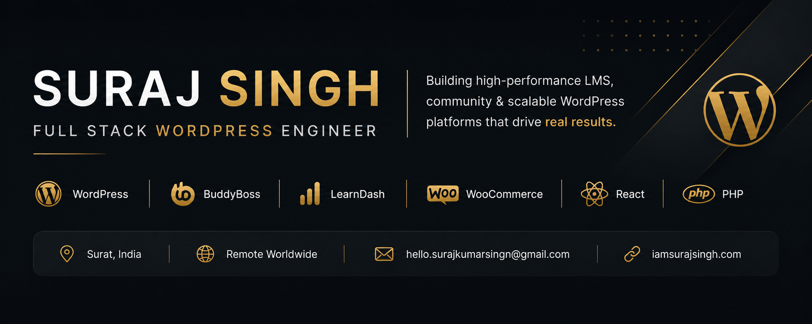

<!-- ============================================================ -->
<!--   Suraj Singh — GitHub Profile README                        -->
<!--   Full Stack WordPress Engineer · Agency Services Specialist -->
<!--   Theme: Gold (#ebbe6a) + Dark Navy (#090e12)                -->
<!-- ============================================================ -->

<!-- ─────────────  Tagline  ───────────── -->

<i>Building high-performance WordPress platforms that drive real business outcomes.</i>

 

<!-- ─────────────  Quick Links  ───────────── -->

  

<!-- ─────────────  Highlight Stats  ───────────── -->

 

---

##  &nbsp;About Me

> **Full Stack WordPress Engineer with 7+ years of experience** crafting high-performance LMS platforms, community products, and AI-augmented WordPress workflows — from custom Gutenberg blocks to agency-scale client delivery.

<table>
  <tr>
    <td width="40" align="center">🏢</td>
    <td width="120"><b>Role</b></td>
    <td>Full Stack WP Engineer · Agency Specialist @ <a href="https://www.buddyboss.com/"><b>BuddyBoss</b></a> &nbsp;<i>(Jan 2024 – Present)</i></td>
  </tr>
  <tr>
    <td align="center">🎓</td>
    <td><b>Education</b></td>
    <td>MCA · Nirma University, Ahmedabad, Gujarat</td>
  </tr>
  <tr>
    <td align="center">📍</td>
    <td><b>Location</b></td>
    <td>Surat, India 🇮🇳 &nbsp;·&nbsp; Available <b>Remote · Worldwide</b></td>
  </tr>
  <tr>
    <td align="center">📄</td>
    <td><b>Resume</b></td>
    <td><a href="https://github.com/surajkrsingh/surajkrsingh/blob/main/resources/docs/suraj-wordpress-developer.pdf"><b>Download PDF</b></a></td>
  </tr>
</table>

 

###  &nbsp;What I Do

<table>
  <tr>
    <td width="50%" valign="top">
      <b>⚡&nbsp; Agency Delivery</b> 
      Lead client projects end-to-end — discovery, architecture, build, delivery & support.
    </td>
    <td width="50%" valign="top">
      <b>🧩&nbsp; Block Editor</b> 
      Custom <b>Gutenberg blocks</b>, <b>FSE themes</b>, and clean <b>REST API</b> integrations.
    </td>
  </tr>
  <tr>
    <td valign="top">
      <b>⚛️&nbsp; Modern Frontend</b> 
      Ship interfaces with <b>React</b>, <b>TypeScript</b>, and <b>Redux Toolkit</b>.
    </td>
    <td valign="top">
      <b>🤖&nbsp; AI Engineering</b> 
      Build <b>MCP servers</b>, AI content writers & intelligent WordPress workflows.
    </td>
  </tr>
  <tr>
    <td valign="top">
      <b>🎓&nbsp; LMS Platforms</b> 
      Architect on <b>LearnDash</b>, <b>LifterLMS</b>, <b>BuddyBoss</b> & <b>BuddyPress</b>.
    </td>
    <td valign="top">
      <b>🔌&nbsp; Plugin Architecture</b> 
      Scalable plugin design following <b>WordPress coding standards</b>.
    </td>
  </tr>
</table>

---

##  &nbsp;Featured Projects & Contributions

<table>
<tr>
<td width="50%" align="center" valign="top">

<b>🔥 &nbsp;BuddyBoss and Agency Client Services</b>

<i>@ <a href="https://www.buddyboss.com/">BuddyBoss</a></i>

  
  Lead end-to-end <b>agency client delivery</b> on the BuddyBoss platform — discovery, architecture, custom builds and ongoing support for community, LMS and mobile-app projects at scale.
  

</td>
<td width="50%" align="center" valign="top">

<b>📚 &nbsp; LearnDash Transfer Plugin & Add-ons</b>

<i>@ <a href="https://honorswp.com/">HonorsWP / Easily Amused</a></i>

  
  Built the <b>Transfer plugin</b> and a suite of <b>LearnDash add-ons</b> — production tooling powering thousands of LMS sites worldwide.
  

</td>
</tr>
<tr>
<td width="50%" align="center" valign="top">

<b>📋 &nbsp; Projectopia & Responsive Menu</b>

<i>@ ExpressTech Systems</i>

  
  Shipped <b>Projectopia</b> (project-management SaaS for WP) and contributed to <b>Responsive Menu</b> — a plugin powering 100k+ sites.
  

</td>
<td width="50%" align="center" valign="top">

<b>🎬 &nbsp; rtMedia (Open Source)</b>

<i>@ <a href="https://rtcamp.com/">rtCamp</a></i>

  
  Contributed to <b>rtMedia</b> — the open-source media plugin powering <b>BuddyPress</b> communities worldwide.
  

</td>
</tr>
</table>

---

##  &nbsp;Experience Timeline

<!-- ─────────────  BuddyBoss  ───────────── -->

<table width="100%">
<tr>
  <td colspan="3" align="center">
    
    &nbsp;&nbsp;
    <kbd>&nbsp;Full-time&nbsp;</kbd>
    &nbsp;&nbsp;
    <code>Apr 2021 — Present</code>
    &nbsp;&nbsp;
    
  </td>
</tr>
<tr>
  <th align="left" width="58%">Role</th>
  <th align="center" width="26%">Period</th>
  <th align="center" width="16%">Tenure</th>
</tr>
<tr>
  <td>▸ &nbsp;<b>Full Stack WP Engineer</b> &nbsp;· Agency Services Specialist</td>
  <td align="center"><code>Jan 2024 → Present</code></td>
  <td align="center"></td>
</tr>
<tr>
  <td>▸ &nbsp;<b>WordPress Developer</b> &nbsp;· BuddyBoss Media LLC</td>
  <td align="center"><code>Apr 2022 → Dec 2023</code></td>
  <td align="center"></td>
</tr>
<tr>
  <td>▸ &nbsp;<b>WordPress Technical Support Engineer</b></td>
  <td align="center"><code>Apr 2021 → Mar 2022</code></td>
  <td align="center"></td>
</tr>
</table>

 

<!-- ─────────────  Easily Amused  ───────────── -->

<table width="100%">
<tr>
  <td colspan="3" align="center">
    
    &nbsp;&nbsp;
    <kbd>&nbsp;Remote&nbsp;</kbd>
    &nbsp;&nbsp;
    <code>Sep 2021 — Aug 2025</code>
    &nbsp;&nbsp;
    
  </td>
</tr>
<tr>
  <th align="left" width="58%">Role</th>
  <th align="center" width="26%">Period</th>
  <th align="center" width="16%">Tenure</th>
</tr>
<tr>
  <td>▸ &nbsp;<b>Full Stack WordPress Engineer</b> &nbsp;· Freelance</td>
  <td align="center"><code>Mar 2022 → Aug 2025</code></td>
  <td align="center"></td>
</tr>
<tr>
  <td>▸ &nbsp;<b>WordPress Engineer</b> &nbsp;· Part-time</td>
  <td align="center"><code>Sep 2021 → Feb 2022</code></td>
  <td align="center"></td>
</tr>
</table>

 

<!-- ─────────────  Earlier Roles  ───────────── -->

<table width="100%">
<tr>
  <td colspan="3" align="center">
    
    &nbsp;&nbsp;
    <kbd>&nbsp;2019 – 2021&nbsp;</kbd>
    &nbsp;&nbsp;
    <code>Three companies</code>
    &nbsp;&nbsp;
    
  </td>
</tr>
<tr>
  <th align="left" width="58%">Role</th>
  <th align="center" width="26%">Period</th>
  <th align="center" width="16%">Tenure</th>
</tr>
<tr>
  <td>▸ &nbsp;<b>WordPress Developer</b> &nbsp;· ExpressTech Systems</td>
  <td align="center"><code>Jan 2020 → Apr 2021</code></td>
  <td align="center"></td>
</tr>
<tr>
  <td>▸ &nbsp;<b>WordPress Developer</b> &nbsp;· Upwork · Freelance</td>
  <td align="center"><code>Aug 2019 → Apr 2021</code></td>
  <td align="center"></td>
</tr>
<tr>
  <td>▸ &nbsp;<b>Web Engineer</b> &nbsp;· rtCamp</td>
  <td align="center"><code>Jan 2019 → Jul 2019</code></td>
  <td align="center"></td>
</tr>
</table>

---

##  &nbsp;Tech Stack

<table>
<tr>
<td width="50%" valign="top" align="center">

####  &nbsp;Languages & Frameworks

 

</td>
<td width="50%" valign="top" align="center">

####  &nbsp;WordPress Ecosystem

 

</td>
</tr>
<tr>
<td width="50%" valign="top" align="center">

####  &nbsp;AI & Automation

 

</td>
<td width="50%" valign="top" align="center">

####  &nbsp;Tools & DevOps

 

</td>
</tr>
</table>

---

##  &nbsp;GitHub Stats

  

  

---

##  &nbsp;Currently Exploring

<table>
  <tr>
    <td width="40" align="center">🔬</td>
    <td><b>MCP Servers</b> for WordPress &nbsp;— bridging WP with LLM-powered agents</td>
  </tr>
  <tr>
    <td align="center">🧪</td>
    <td><b>Claude Code & Agent SDK</b> &nbsp;— supercharging dev productivity workflows</td>
  </tr>
  <tr>
    <td align="center">📚</td>
    <td><b>Full Site Editing</b> & block-based architecture &nbsp;— next-gen WP theming</td>
  </tr>
</table>

---

##  &nbsp;Let's Build Something

> **Have an LMS to scale, a community to launch, or an AI workflow to integrate?** &nbsp;Let's talk.

 

&nbsp;

&nbsp;

  

⭐ &nbsp;<i>If you find my work useful, a star on a repo means a lot.</i> &nbsp;⭐

  

<i>Crafted with care · Built on WordPress · Powered by curiosity</i>

